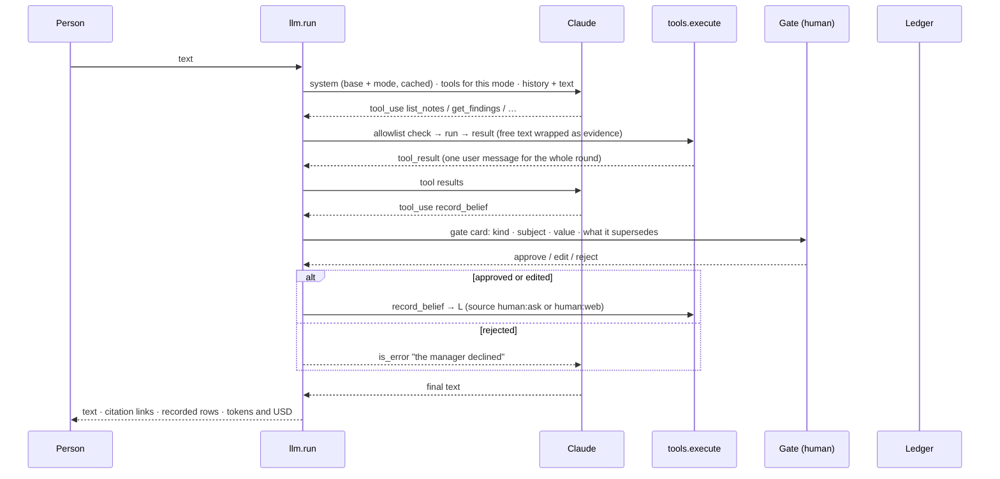

# One agent turn (ask mode)

```mermaid
sequenceDiagram
  participant U as Person
  participant S as llm.run
  participant M as Claude
  participant T as tools.execute
  participant G as Gate (human)
  participant L as Ledger
  U->>S: text
  S->>M: system (base + mode, cached) · tools for this mode · history + text
  M-->>S: tool_use list_notes / get_findings / …
  S->>T: allowlist check → run → result (free text wrapped as evidence)
  T-->>S: tool_result (one user message for the whole round)
  S->>M: tool results
  M-->>S: tool_use record_belief
  S->>G: gate card: kind · subject · value · what it supersedes
  G-->>S: approve / edit / reject
  alt approved or edited
    S->>T: record_belief → L (source human:ask or human:web)
  else rejected
    S-->>M: is_error "the manager declined"
  end
  M-->>S: final text
  S-->>U: text · citation links · recorded rows · tokens and USD
```

The model chooses wording and which allowed tools to call. It cannot choose a number, a state
transition, or a belief without a person.
