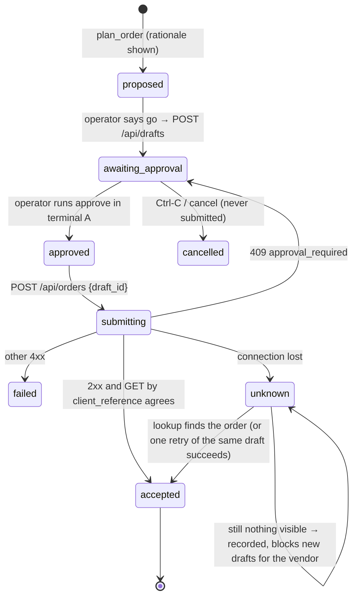

# Order state machine

```mermaid
stateDiagram-v2
  [*] --> proposed: plan_order (rationale shown)
  proposed --> awaiting_approval: operator says go → POST /api/drafts
  awaiting_approval --> approved: operator runs approve in terminal A
  awaiting_approval --> cancelled: Ctrl-C / cancel (never submitted)
  approved --> submitting: POST /api/orders {draft_id}
  submitting --> accepted: 2xx and GET by client_reference agrees
  submitting --> awaiting_approval: 409 approval_required
  submitting --> failed: other 4xx
  submitting --> unknown: connection lost
  unknown --> accepted: lookup finds the order (or one retry of the same draft succeeds)
  unknown --> unknown: still nothing visible → recorded, blocks new drafts for the vendor
  accepted --> [*]
```

A lost response never creates a second draft. "Accepted" means the supplier recorded the order,
not that anything shipped.
