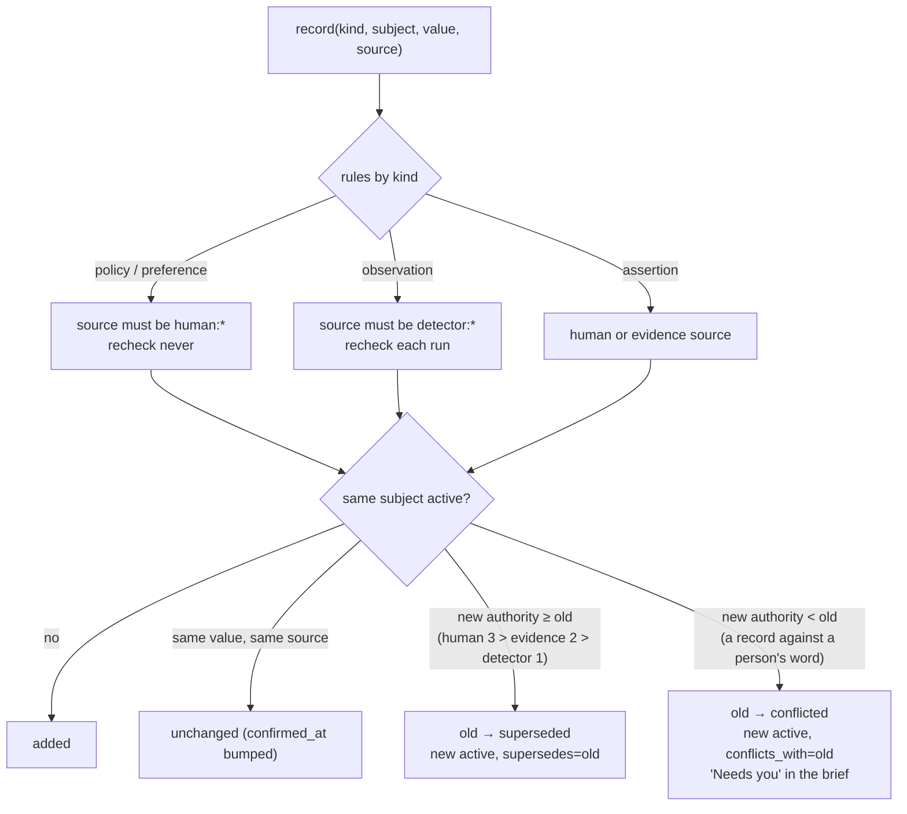

# Belief lifecycle

```mermaid
flowchart TD
  W["record(kind, subject, value, source)"] --> R{"rules by kind"}
  R -- "policy / preference" --> HU["source must be human:*<br/>recheck never"]
  R -- "observation" --> DE["source must be detector:*<br/>recheck each run"]
  R -- "assertion" --> EV["human or evidence source"]
  HU --> C{"same subject active?"}
  DE --> C
  EV --> C
  C -- "no" --> ADD["added"]
  C -- "same value, same source" --> UN["unchanged (confirmed_at bumped)"]
  C -- "new authority ≥ old<br/>(human 3 > evidence 2 > detector 1)" --> SUP["old → superseded<br/>new active, supersedes=old"]
  C -- "new authority < old<br/>(a record against a person's word)" --> CON["old → conflicted<br/>new active, conflicts_with=old<br/>'Needs you' in the brief"]
```

Nothing is deleted; `why <subject>` walks the chain. A person can always supersede a conflict.
